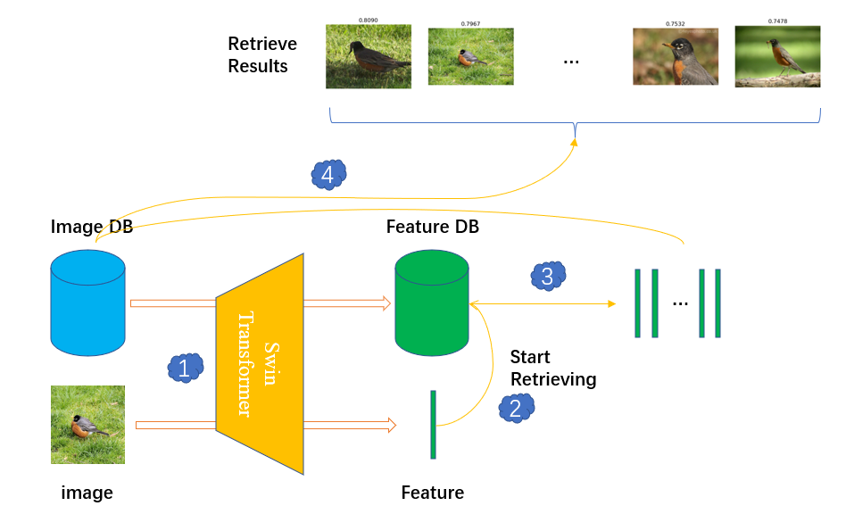

# Swin-transformer based CBIR

This repository contains a CBIR(content-based image retrieval) system. Here we use [Swin-transformer](https://github.com/microsoft/Swin-Transformer) to extract query image's feature, and retrieve similar ones from image database. Notably, our program achieves intelligent user interaction, including selecting an image by opening explorer dialog and cropping interested region by drafting mouse.



## Structure

```python
SWIN_CBIR/
|-- checkpoints/
|
|-- database/
|   |-- data/
|   |   |-- 1.jpg
|   |   |-- 2.jpg
|   |  
|   |-- DB.npz
|   |-- index.txt
|
|-- models/
|   |-- __init__.py
|   |-- build.py
|   |-- swin_transformer.py
|
|-- scripts/
|   |-- generate_DB.sh
|
|-- test/
|
|-- config.py
|-- database.py
|-- generate_DB.py
|-- main.py
|-- requirements.txt
|-- README
```

## Getting Started

1. Prepare images database

    Just find out some images and put them into `database/data/`.
2. Download swin-transformer checkpoint at [swin_tiny_patch4_window7_224.pth](https://github.com/SwinTransformer/storage/releases/download/v1.0.0/swin_tiny_patch4_window7_224.pth), and then move it into `checkpoints`.

3. run `./script/generate_DB.sh` in linux machine to extract features of all images and package them into `DB.npz`.

4. run `main.py`, open an image and select interested region, then program will find similar images in database automatically!

